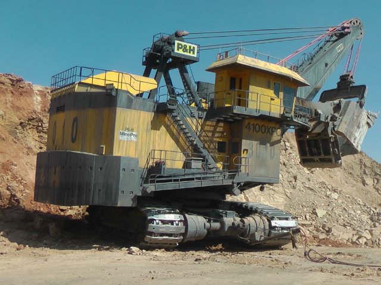
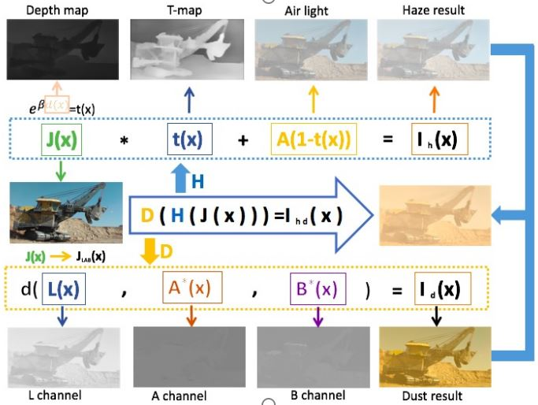

# OMSD

## Introduce
we constructed a large, high-quality, and diverse dataset, named as Open-pit Mine Sand-dust Dataset (OMSD) . we collected more than 1000 high-quality images from open-pit mines to ensure the diversity of samples.


<div align="center">
    <a href="./">
        
    </a>
</div>

## the generation of OMSD

we divide the generation of OMSD into two parts: first blurring (fog) and then color deviation. The OMSD is generated on 1006 high-quality dust-free images, and each dust-free image is rendered into 10 different levels of sand-dust images making a total of 10060 images generated. 6750 images are used as training set, and the rest 3310 images astest set .

<div align="center">
    <a href="./">
        
    </a>
</div>

## dataset file

```
dataset
     +-- train
     |   +-- real
     |   +-- fake
     +-- test
     |   +-- real
     |   +-- fake

```

## download dataset

baiduyun：https://pan.baidu.com/s/1uCodevbNpPqlkkSVZ1BeJA 

password：vmz7 

# News

- update the datasets information!

- updata the datasets Preprocessing script (is coming!).


